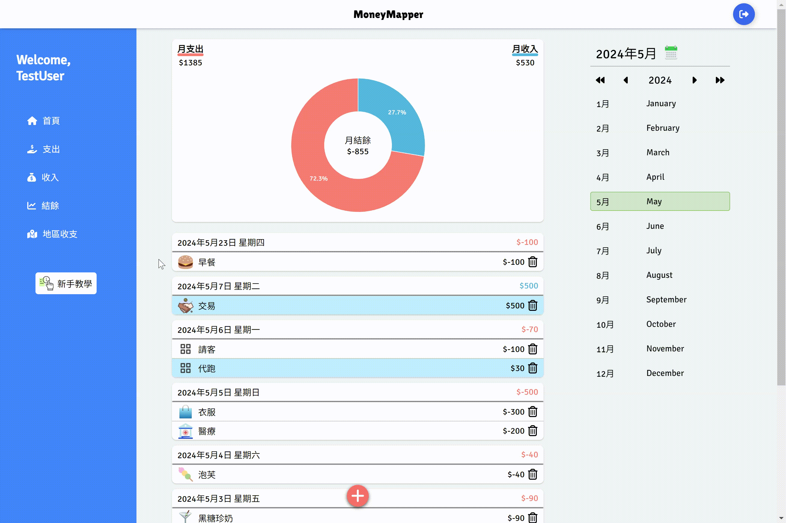
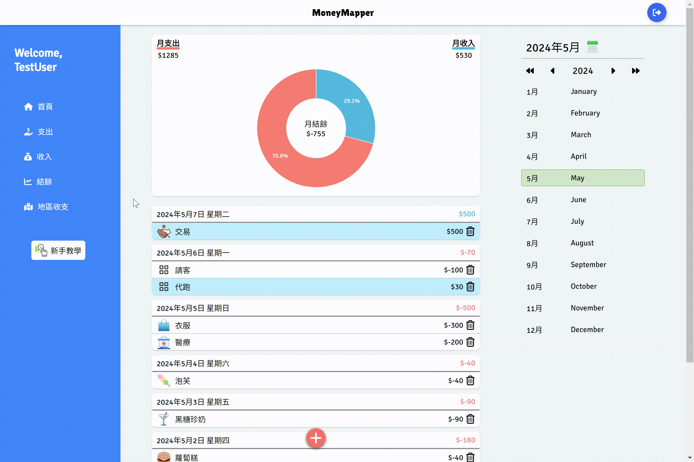

  

  

    <a href="https://github.com/sampleleaf/moneymapper?tab=readme-ov-file#about-moneymapper">About</a>
    |
    <a href="https://github.com/sampleleaf/moneymapper?tab=readme-ov-file#demo">Demo</a>
    |
    <a href="https://github.com/sampleleaf/moneymapper?tab=readme-ov-file#contact">Contact</a>
  

# MoneyMapper
[MoneyMapper](https://moneymapper.site/) is a SPA website for tracking expenses and income. In addition to standard features, it offers a new feature to view income and expenses by region.

## About MoneyMapper
- Managed date-related state in React with `Zustand`.
- Utilized `Firebase Firestore` as the database to implement CRUD operations for accounting.
- Developed the feature to mark selected regions using `Leaflet`, Nominatim, and GeoJSON.
- Created the landing page using `GSAP`.

## Built with

**Base**
- React / React Router
- TypeScript
- Firebase

**Libraries**
- Zustand
- Leaflet
- GSAP
- react-google-charts
- react-calendar
- react-driver.js

### Flow chart

### Demo
- How to account

- How to edit and delete

- How to view details

- How to view income and expenses by region

### Contact
  
  
